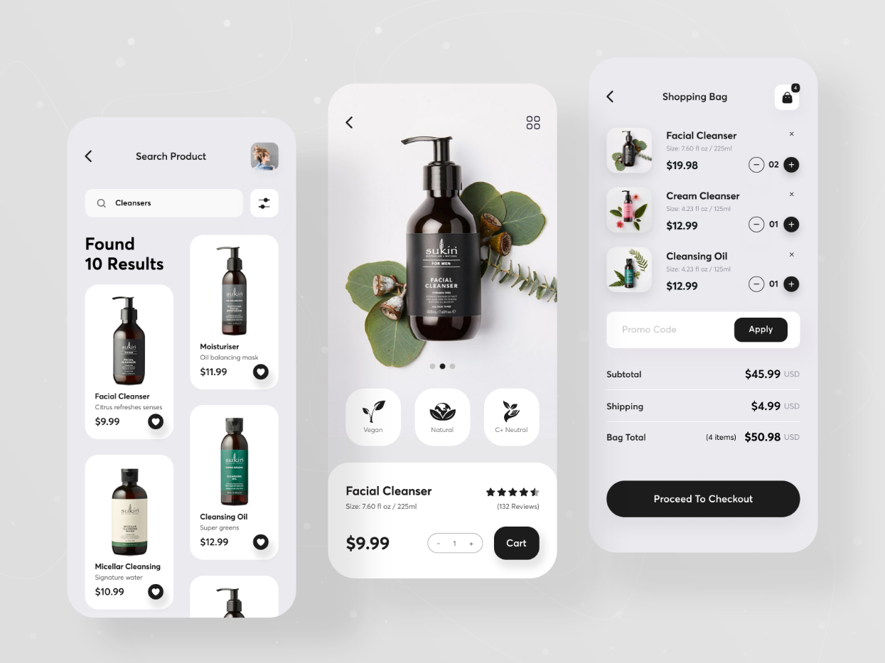

> 

> Follow us for more projects like this [Check my github profile](https://github.com/jayson7)

BeautyAppis an exciting project that combines the power of React Native and Sanity to create a captivating hybrid mobile app for a beauty product shop. In this project, you will have the opportunity to learn and explore various technologies, including:

# React Native

```
React Native is a popular JavaScript framework that allows you to build native mobile apps using a single codebase. You will learn how to develop cross-platform mobile applications for both iOS and Android platforms, leveraging the efficiency and flexibility of React Native.
```

# Components and Compositions

```
At the start of this project i was wishing i will be using sanity as a server but i switched to Django as it makes me more comfortable
```
